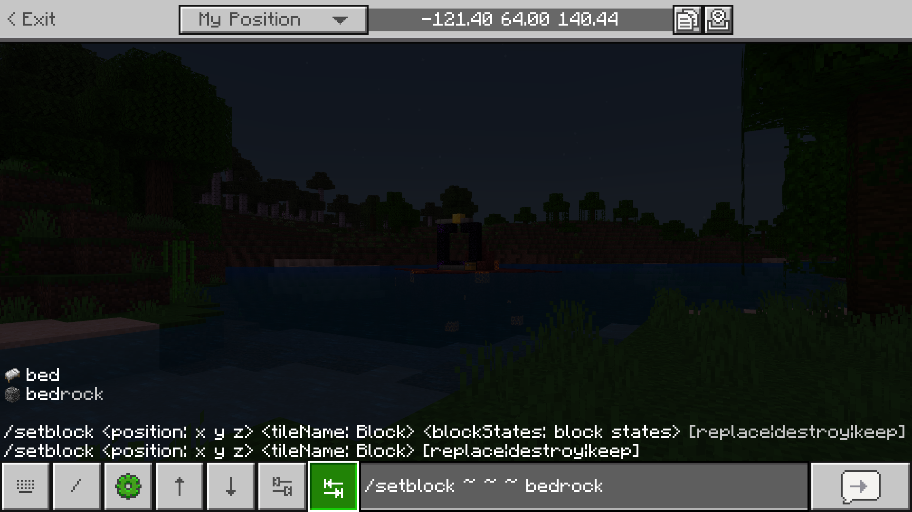
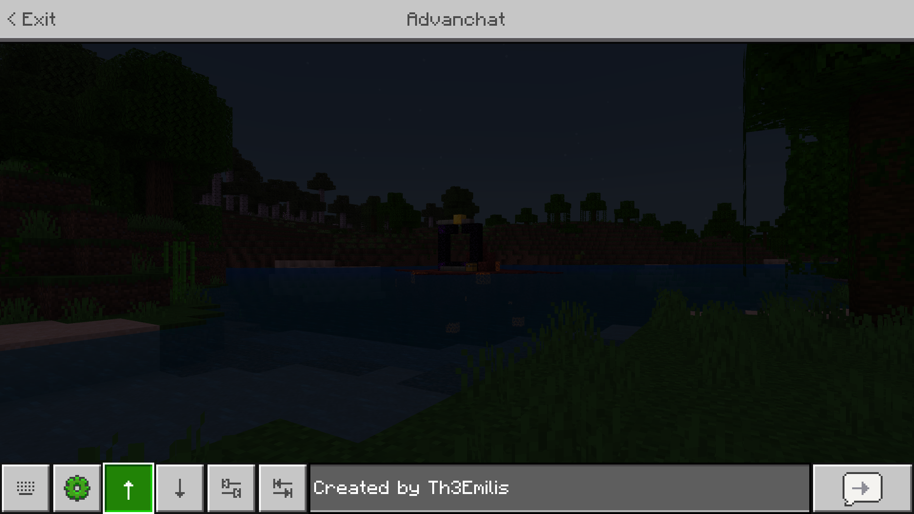
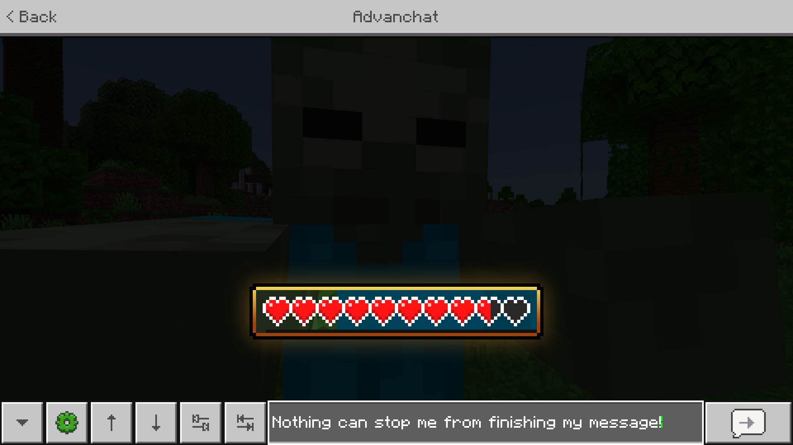
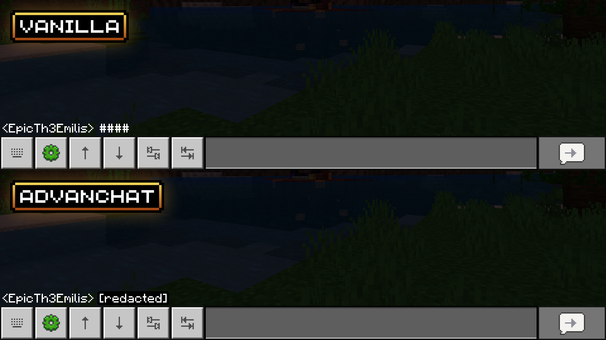
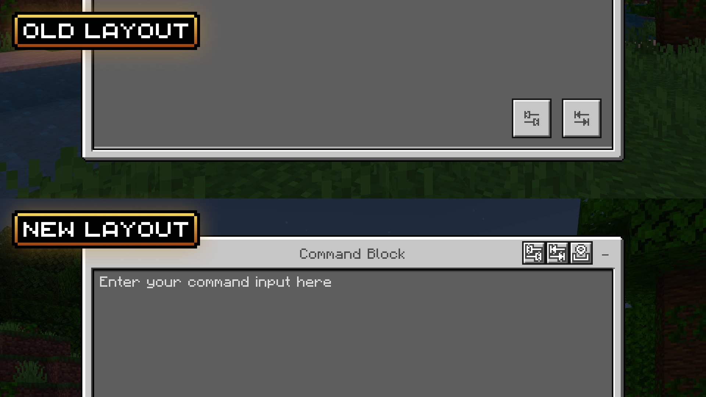
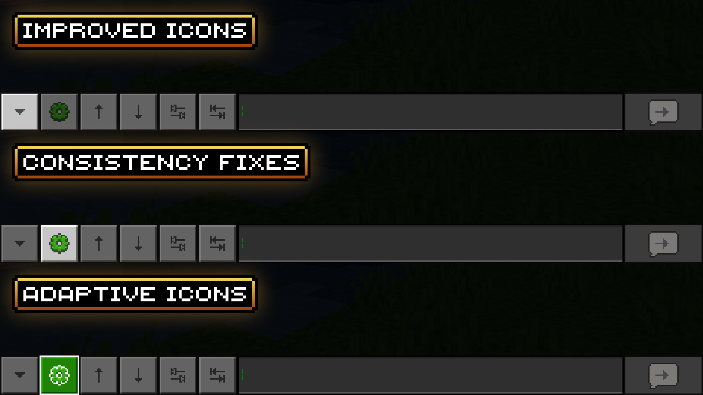

# Advanchat

> Created by [Th3Emilis](https://github.com/th3emilis)

Originally designed to improve the chat screen for touch players, the new Advanchat goes beyond that, introducing features and tweaks that mobile, PC, and console players can all enjoy. Command autocomplete, message history, and more, for everyone.

## Features

### Autocomplete buttons
Use the tab buttons to autocomplete your commands.

### Message history buttons
Use the arrow buttons to navigate between your previous messages and send them again.

### Uninterrupted typing
Prevent the chat screen from closing when taking damage.

### No chat filter
Display the contents of messages that would otherwise show up as a sequence of number signs.

### Autocomplete buttons for command blocks
The tab buttons can also be used in command blocks. You can choose between two different layouts, based on your preferences.

### UI tweaks and details
The add-on includes minor UI fixes to refine the look and experience of the chat screen interface even more.

## Extension Packs

Some features are only available via the extension packs bundled with the base add-on. To access those features, you must enable the appropriate extension packs.

Extension packs only work when used alongside the base pack, but the base pack can be used on its own. So, if you are not looking forward to using any of the features provided by the extension packs, you can delete them to save up space. If you ever change your mind, simply reinstall the add-on to recover the extension packs.

## Terms of Use

By downloading, installing, accessing, using or interacting in any way with this add-on, you agree to be bound by the following terms:
- **Attribution** — You must give proper credit to the creator if you reference, use or feature any of the add-on contents (user interface, files, etc.) in your own content, such as videos, blogs, or social media posts.
- **No Redistribution** — You may not reproduce, redistribute or republish the add-on in any form or by any means. You may not share the direct download link or any user-generated link to the add-on. Use one of the [official links](https://github.com/th3emilis/advanchat/blob/main/OFFICIAL_LINKS.md).
- **Non-Commercial** — You may not use the add-on for any commercial or revenue-generating purposes, such as advertising, selling or renting. You may not charge any fees or request any donations for accessing or using the add-on.
- **No Derivates** — You can remix, adapt or build upon the add-on for your own private use, but you may not share, distribute, or make available the modified version of the add-on to any third party. You also agree not to use any part of the add-on (such as files or code snippets) in other add-ons.

## Feedback

For any suggestions, bugs or help, feel free to [join the Discord community](https://discord.gg/skqthyTkBQ).
