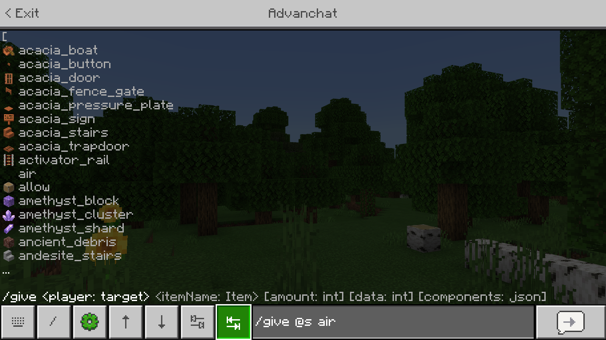
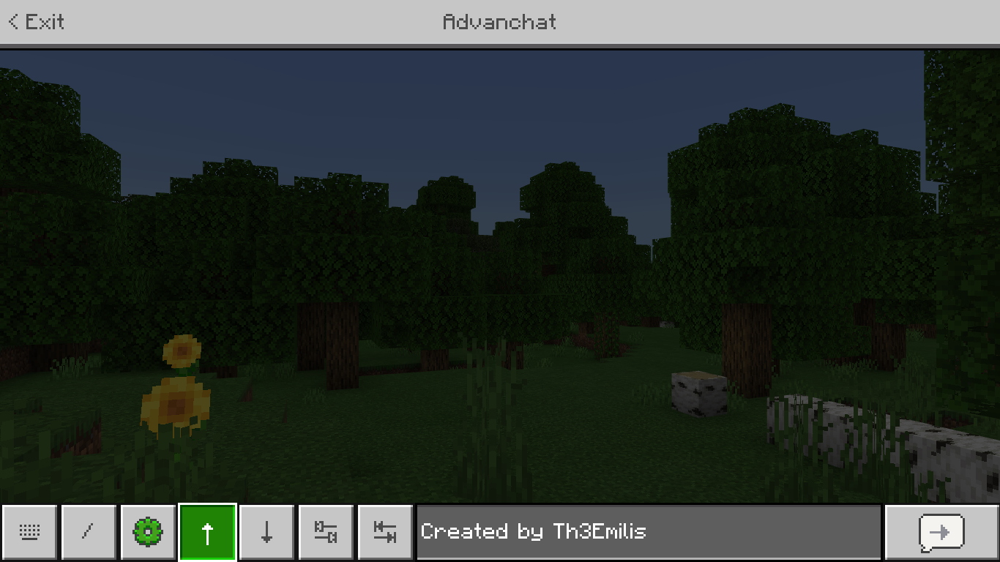

# Advanchat

*Created by [Th3Emilis](https://github.com/th3emilis)*

Advanchat aims to improve the experience of touch players when using the chat screen by implementing useful features such as autocompletion abilities only available to keyboard players up until now.

## Features

Advanchat simplifies the chat screen experience of touch players with small but useful features like tab buttons to autocomplete your commands or arrow buttons to let you navigate between your previous messages and send them again.

Other features include UI fixes, such as proper focus state effect for buttons, and the ability to prevent the chat screen from closing when taking damage.

Some features are only available by enabling the extension packs bundled with the base add-on. If you do not plan to use any of the additional features, simply delete the extension packs. If you change your mind, reinstall the add-on to recover them.

## Terms of Use

By downloading, using or interacting in any way with this add-on, you agree to the following terms:
- **No Derivates.** You can remix, adapt or build upon the add-on as long as it is for private use (this means that you may not publish or distribute it anywhere).
- **Non-Commercial.** You may not monetise, sell, or profit from the add-on in any way.
- **Redistribution.** You may not redistribute or republish the add-on.
- **Sharing.** You may not share the direct download link or any user-made link of the add-on. Use the official GitHub repo link.
- **Attribution.** You may give proper credit if any of the add-on contents (UI, files, etc.) appear in your content, such as videos.
- **No bundling.** You may not include the add-on files or snippets from them in other add-ons. You may, however, provide a link to the add-on’s official GitHub repo page.

## Feedback

Whether you have an idea to improve the add-on, find a bug, or face an issue you need help with, [let me know](https://discord.gg/z9ngSYp)!
